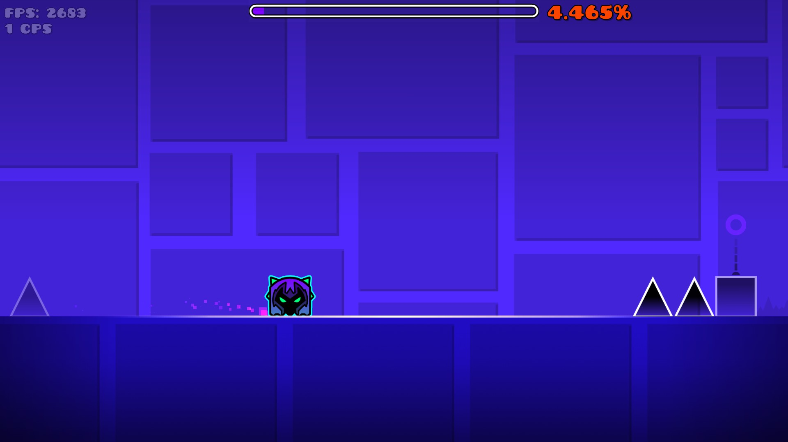

# Better Percentage

Better Percentage is an open-source mod for Geometry Dash that enhances the in-game percentage display with higher precision and additional customization options, while preserving the original look and feel of the game.

> [!WARNING]
> This mod is under active development and may contain bugs or unexpected behavior. Use at your own risk and report any issues through the repository issues page.

This version of Better Percentage supports Geode v5.3.0 and Geometry Dash 2.2081+

---

## Installation

Better Percentage is a [Geode](https://geode-sdk.org/) mod, so it requires Geode to be installed first. Once that is set up, you can install the mod through the Geode Index or download the latest `.geode` file from the [Releases](https://github.com/skun0/better-percentage/releases/tag/Release) page.

---

## Features

* High precision percentage display
* Customizable text scale
* Optional dynamic rainbow coloring based on progress
* Configurable static color
* Seamless integration with the default Geometry Dash UI
* Lightweight and performance-friendly



---

## Settings

The mod provides the following configuration options:

* Enable Mod
* Decimals (0–50)
* Percentage Text Scale
* Rainbow Mode
* Static Color

---

## Compatibility

Better Percentage is available on all platforms supported by Geode:

* Windows
* Android
* macOS
* iOS

---

## Building

For the most part, building is the same as any other Geode mod. See the official [documentation](https://docs.geode-sdk.org/getting-started/cpp-stuff):

Then run:

```
geode build
```

---

## Notes

* The mod is designed to remain clean and non-intrusive

---

## Future Plans

* I will continue updating this mod, but if you have any suggestions or ideas, feel free to share them.

---

## Support

If you encounter any issues or bugs, please open an issue on the repository or contact me on [Discord](https://discord.com/users/1094935665952702534).
